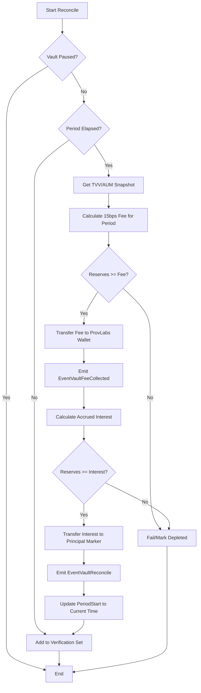

**Context**

This design task defines the architectural flow, integration points within the existing interest reconciliation lifecycle, and the audit requirements for fee collection for the Nu.xyz AUM-based technology fee.

**Dependencies**
- **Blocked by:** Confirmation of the final ProvLabs Bech32 group account address for testnet and mainnet.
- **Depends on:** Existing `reconcileVaultInterest` logic and `GetTVVInUnderlyingAsset` valuation engine.

**What needs to be done**

- **Map Reconciliation Flow:** Integrate the fee collection step into the existing vault reconciliation sequence.
- **Define Event Schema:** Specify the attributes for the `EventVaultFeeCollected` to ensure compatibility with indexers.
- **Draft Error Handling Strategy:** Define how the system responds when a vault has insufficient reserves for the technology fee (e.g., halting reconciliation vs. auto-pausing).
- **Audit Trail Specification:** Ensure all fee transfers are traceable to a specific vault and time period.

**Technical details**

### Flow Chart (Vault Reconciliation with AUM Fee)

- **Calculation Logic:** Fees are calculated linearly (Pro-rata) based on the snapshot of TVV at the moment of reconciliation.
- **Account Roles:** 
    - **Source:** Vault Reserve Account (The `VaultAccount` itself).
    - **Destination:** ProvLabs Group Account (Hard-coded).
- **Denomination:** Determine if fees are settled exclusively in the `UnderlyingAsset` or `PaymentDenom` of the vault.

### Open Questions / Design Considerations

1. **Insufficient Reserves & Principal Liquidation:**
   - **Scenario:** If the vault manager fails to fund the reserves (interest account), the vault will have insufficient funds to pay the AUM fee.
   - **Question:** Should the module automatically transfer funds from the **Principal (Marker Account)** to the **Reserves** to cover the fee?
   - **Impact:** Moving principal to pay fees reduces the Total Vault Value (TVV) and subsequently the NAV-per-share (devaluation). This must be explicitly handled to avoid "stealth" devaluation without proper event logging.
   - **Alternative:** If reserves are empty, do we auto-pause the vault and prevent further operations until the fee is settled?

2. **Settlement Denomination:**
   - **Question:** Should the fee be collected in the `UnderlyingAsset` (canonical unit) or `PaymentDenom`?
   - **Consideration:** Collecting in `UnderlyingAsset` is simpler for accounting, but `PaymentDenom` might be more liquid in some composite vault scenarios.

3. **Routing to ProvLabs:**
   - **Question:** Is there a separate address for Testnet vs Mainnet, or a single global constant? (Pending Dan's confirmation).

**Acceptance Criteria**
- [ ] Reconciliation flow chart is approved and accurately represents the implementation path.
- [ ] Fee collection is prioritized to occur *before* interest settlement.
- [ ] Schema for `EventVaultFeeCollected` includes: `vault_address`, `amount`, `aum_snapshot`, `duration_seconds`.
- [ ] Strategy for insufficient funds is documented and consistent with module security standards.
